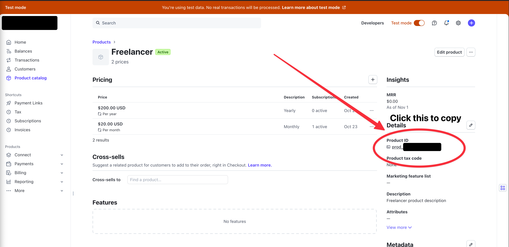

# React + Vite + shadcn/ui + Supabase + Stripe

This is a fullstack project template that uses Deno, React, Vite, shadcn/ui, Supabase, and Stripe. Its designed to be a fast and simple way to get your SaaS project off the ground with minimal setup.

## Features
- Integration with Stripe for payments
- Use Supabase for database, authentication, and serverless functions
- Use shadcn/ui for frontend components
- Use Vite for frontend development with Deno 2.0
- Use React Router Dom for frontend routing
- Entire built app is less than 150KB compressed and can be hosted on Vercel, Cloudflare Pages, and more!

### Why Vite and React Router Dom over NextJS?
NextJS has become a bit of a beast. Its massive, the app router has lots of slowdowns and memory problems when in development, and Turbopack only recently entered 1.0. Vite is much faster in both development and production, significantly decreasing the footprint of the deployed app. React Router Dom is a mature and well supported library, while also being compact and staying out of the way, so we don't have to worry about massive development overhead. Since the backend and frontend are separate, the frontend can be deployed to a super fast CDN like Cloudflare Pages or GitHub Pages, while the backend lives Supabase.

### Why Supabase?
Supabase was the best option for a backend as they handled the database, the CRUD operations, user authentication, and serverless backend functions, while keeping all four elements tightly integrated. This doesn't mean you're vendor locked either - Supabase has a [self hosted option](https://supabase.com/docs/guides/self-hosting) if you don't want to use their cloud service.

# Prerequisites
- [Deno 2.0](https://deno.com/)
- [Docker](https://www.docker.com/)
- [Supabase CLI](https://supabase.com/docs/guides/local-development/cli/getting-started)
- [Stripe CLI](https://stripe.com/docs/stripe-cli)
- [Stripe Account](https://stripe.com/)
- [Overmind](https://github.com/DarthSim/overmind) (optional but recommended).

# Quick Start

## 0. Use the template.

Before cloning, you should use the template to create a new repository. Simply click the "Use this template" button on the top right of the repository (or [this link](https://github.com/new?template_name=vite-shadcn-supabase&template_owner=chand1012)).

## 1. Clone the repository

```bash
git clone https://github.com/your-username/your-repo.git
cd your-repo
```

## 2. Project Setup

```bash
cp .env.example .env
cp supabase/.env.example supabase/.env
deno install
supabase start # get your supabase url and anon key and put it in .env.local file
stripe login # login to stripe for CLI use
```

## 3. Product Setup

Before we can continue development, we should set up products in Stripe. This can be done either via the Stripe dashboard, or manually via the Stripe CLI (recommended). Open the project in your preferred editor and start editing the stripe products file found in `fixtures/stripe-fixtures.json`. As this is a SaaS product, your products are broken down into products and prices for those products, which are monthly and yearly subscription prices. You can read more about the Stripe Fixtures [here](https://docs.stripe.com/cli/fixtures), but for now we can simple use the existing fixtures to create the products.

```bash
stripe fixtures fixtures/stripe-fixtures.json
```

From these fixtures, you'll need your product IDs and Stripe secret key, which should be gathered from the [Stripe Dashboard](https://dashboard.stripe.com/) (if there's a way to do this via the CLI, please let me know or submit a PR). You can get your testing secret key [here](https://dashboard.stripe.com/test/apikeys). You can get your product IDs from the product catalog page in the dashboard. Click on each product and copy the IDs by clicking on them. Here is an example of what that looks like.



You'll want to copy all product IDs into the environment variables file found at `supabase/.env` under the name `PRODUCTS`. Here is an example of what it should look like.
```
PRODUCTS=prod_1234567890,prod_1234567890 # there should only be two for now
```

The application will use these product IDs to dynamically get prices, names, and descriptions for the products.

## 4. Start The Development Server

If you installed the recommended development dependency Overmind, you can start the development server with the following command.

```bash
overmind start
```

Otherwise, you'll have to open 3 terminals and run the following commands in each.

```bash
# Terminal 1
deno task dev
# Terminal 2
deno task serve
# Terminal 3
deno task stripe-webhook
```

## 5. Tearing Down 
When you are finished development, you can simply `ctrl+c` out of the processes for both Overmind and the separate terminals. Once that is complete you can simply run the following to tear down the Supabase instance.

```bash
supabase stop
```

## TODO
- [x] Create payment page
- [x] Create user page
- [x] add link to manage subscriptions on stripe on the user page
- [x] database migrations for subscriptions and payments
- [x] Database migrations for user data (name, and other details. Use email as primary key)
- [x] Make payments work via Stripe
- [x] make backend update for subscriptions
- [ ] Add affiliate system
- [ ] Create good documentation
